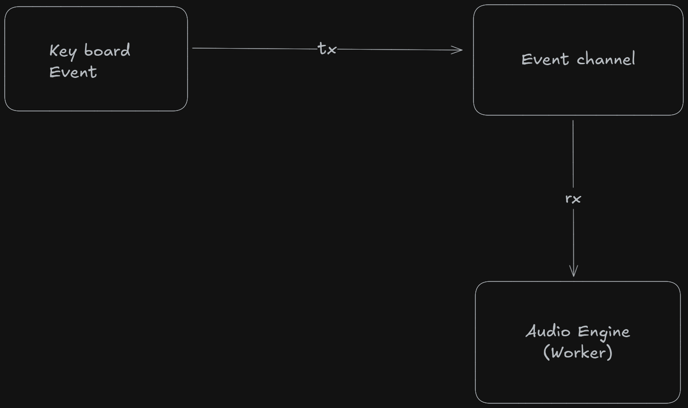

# Mechyvibes

A Mechvibes alternative written in Rust

## Overview

RustyVies is a lightweight, cross-platform mechanical keyboard sound simulator, inspired by Mechvibes and written entirely in Rust.

The application plays realistic mechanical keyboard sounds (key press / release) in real time while typing, with a strong focus on low latency, safe concurrency, and efficient audio event handling using Rust’s message-passing (tx / rx) concurrency model.

## Features

- ⌨️ Real-time mechanical keyboard sound playback

- 🔊 Support for key press / release sound events

- 🧵 Concurrent event handling using Rust channels (tx / rx)

- ⚡ Low-latency audio playback

- 🛡️ Memory-safe and data-race-free by design

- 🦀 Built entirely in Rust

## Architecture

RustyVies is built around an event-driven, concurrent pipeline:

## Why channels?

- Keyboard events are produced rapidly and asynchronously

- Audio playback must be non-blocking

- Channels allow:

  - decoupling input capture from audio playback

  - clean separation of responsibilities

  - safe concurrency without shared mutable state